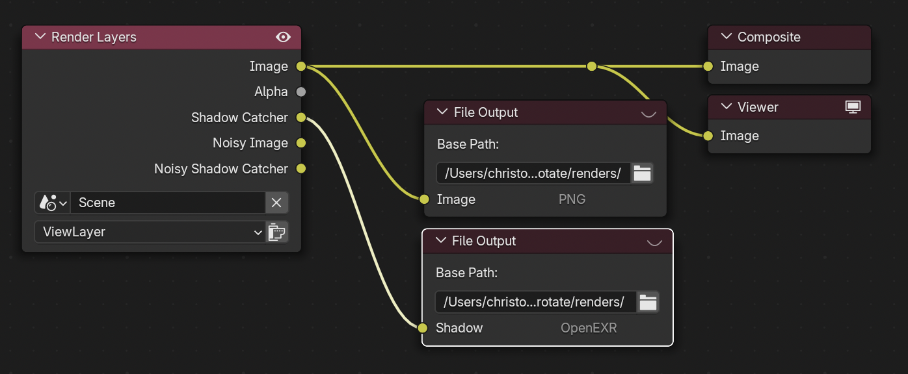

# Lighting in Motion

This is the repo with all the required code to train and run inference of LiMo.

The repo contains 4 main parts:
- Video model code
- Image model code
- HDR optimization code
- Metrics scripts
- Gradio demo for inference

# Setup

### Repo
The repo must be cloned with recursive
```
git clone --recursive https://github.com/Eyeline-Labs/LiMo
cd LiMo
```

### Conda env
```
conda env create -f environment.yml
conda activate LiMo
```
Pip dependencies:
```
pip install -r requirements.txt
```

Requires ffmpeg:
```
apt install ffmpeg -y
```

### Weights
The weights for the **video** model can be downloaded [here](https://drive.google.com/drive/folders/1-yioeRIOz2ENW5xspSuvETQepBm2TV6G?usp=sharing)


The latest weights for the **image** model can be downloaded [here](https://drive.google.com/drive/folders/1RS_nycSdVHqrO2n5cjRigKusuaviJQxu?usp=sharing)


Place both downloaded folders in the `checkpoints` directory:
```
mkdir checkpoints
```


# Gradio demo
Two distinct gradio scripts are in the repo, depending on the image or video model. Both can run on a single A100 40Gb GPU
```
python gradio_image.py
```
```
python gradio_video.py
```

The gradio app requires to follow the steps:
- 1: Input + depth estimation. place the video or image in the input field. The number of frames can be changed (Will take the N first frames of the video), but the video model is trained for 21 frames. The image model will run independantly per-frame. **Make sure to download the "original_frames.zip file** for later composition.
- 2: Export to blender. Creates a blender file with the position maps predicted and a default sphere. You can move and rescale the sphere in space, and set keyframes.
- 3: Sphere Data Input. When the sphere is placed, set the blender tab to scripting (or open the Text editor window), select the "extract_sphere_data.py" script and run it. This will print a python list in the terminal (**Blender must be started from a terminal**). Paste this list in the text field of gradio.
- 4: Prepare maps. This will create the required conditioning maps for inference from the sphere's position and size.
- 5: Inference (**Optional**). This tab allows to infer the sequence at a given sphere type and EV value. It is useful to test seed values for better results.
- 6: Inference All. This will run the inference for every combination of EV and sphere type.
- 7: HDRi Optimization. From the Infered sphere images, this tab allows to merge into a single HDR equirectangular map. When using the video model, the "temporal Consistent Optimization" should be checked for better results. **Make sure to download the "hdr_envmaps.zip file** for later composition.
- 8: Blender Scene. This will export one final Blender file with the HDR maps set as light sources for each frame (The unzipped hdr_optimization folder must be in the same directory as the .blend file). In this blender file, the sphere can be replaced with the object to relight. Tip: the default Blender object tracking can be used to fix an object in the scene (object instead of scene because the camera is treated as fixed). 
### composition
To obtain renders to use for composition, there are a few modifications to this blender file.
- Set the resolution of the render to the original files' resolution (our method rescales).
- Reduce the number of render samples to something managable (e.g. 128)
- Activate Shadow Catcher pass in `View Layer -> Passes -> Light -> Shadow Catcher`.
- The compositor must be set to use Nodes and be set as the following setup. The main image as a png output named `Image` in the `renders` folder and the Shadow catcher saved as an EXR named `Shadow`in the same `renders` folder.


Once the renders are complete, both the `renders` and `original_frames` folders can be copied to the same directory (on the machine where the LiMo repo resides). The composition is then done with:
```
python composite.py --data_path path/to/folder --shadow_factor 1
```

# Data structure
All inference and training other than the gradio demo expects the following structure for the datasets:
```
-output_dir
    -lighting_%04d
        -camera_%04d
            -object_%d
                -frame_%04d
                    -sphere_0
                    -sphere_1
                        camera_info.pkl
                        sphere_info.pkl
                        {maps}
                    camera_info.pkl
                    {maps}
```


An example dataset `classroom` can be downloaded [here](https://drive.google.com/file/d/1iL0aSn9LU9MZat0ezti40iXJwxr9wcRt/view?usp=drive_link) and extracted in the `dataset` directory.

The bash scripts and config files are set with this path as input data and `outputs/` as output. This can be changed with the appropriate paths.


# Video model
The code required for the video model is based on DiffSynth-Studio and is in the `video` folder

### Training
Training is done though the `Wan2.2_train.sh` script and can be ran as follows:
```
 cd video
 . Wan2.2_train.sh
```
The config is done through the arguments in the bash script

### Inference
Inference is done though the `Wan2.2_test.sh` script and can be ran as follows:
```
 cd video
 . Wan2.2_test.sh
```
The config is done through the arguments in the bash script


# Image model
The code required for the image model is in the `image` folder


### Training
Training is done though the `train_conditioned_DM.py` script and can be ran as follows:
```
 cd image
 python train_conditioned_DM.py balls
```
Where balls is a config defined in `train_config.py`

### Inference
Similarly, inference of a dataset is done through:
```
 cd image
 python test_sphere.py balls
```
Where balls is defined in `test_config.py`


# HDR optimization
The code for the HDR optimization is in the `HDRMerge` subfolder.
Again, the code is distinct for the image or video model

It uses a Pyramid of Laplacian for the HDR equirectangular and samples randomly the EV and sphere type from the predictions.

For image model:
```
cd HDRMerge
. merge_image.sh
``` 

For video model:
```
cd HDRMerge
. merge_video.sh
``` 

There also is a script to HDR merge the GT, which uses the GT rendered exr rgb. This is done as blender's hdr equirectangular render ignore some direct view light sources, whereas they show in the mirror sphere.
```
cd HDRMerge
. merge_gt.sh 
```


# Metrics

The code for the HDR optimization is in the `metrics` subfolder.

### Render test scene 
To obtain the metrics from the paper, the optimized HDRi must first be used to relight a test scene.
The script `render_metrics.py` uses the blend file `test_scene.blend` and sets the optimized HDR as world lighting before rendering.
The script is run as such for the image predictions:

```
cd metrics
python render_metrics.py --blender_path [path to blender executable] --data_path ../outputs/classroom_image
```
`--data_path` can be changed to `../outputs/classroom_video` for video predictions and to `../datasets/classroom` for GT.

### Metrics
Once the test scene is rendered for both the GT and predictions, the metrics from the paper can be obtained with the two following bash by setting the correct paths.
```
python metrics_renders_separate.py --gt ../datasets/classroom --pred ../outputs/classroom_image
python metrics_renders_separate_time.py --gt ../datasets/classroom --pred ../outputs/classroom_image 
```
`--pred` can be changed to `../outputs/classroom_video` for video predictions.

Those same render and metrics scripts are used for both image and video models.
